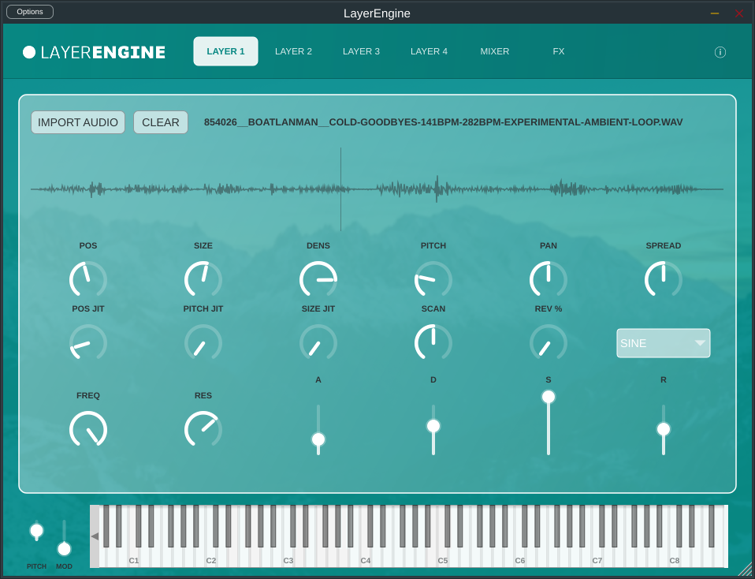

# Layer Engine

<p align="center">
  
</p>

<p align="center">
  <a href="https://github.com/samplaman/layerengine/actions/workflows/auto-release.yml">
    
  </a>
</p>

<p align="center">
  
</p>

---

Layer Engine is a professional quad-layer granular synthesizer built with C++ and the JUCE framework. Designed for sound design and atmospheric textures, it allows users to stack up to four independent granular engines, each with its own modulation, filtering, and spatialization controls.

## Key Features

- Quad-Layer Architecture: Mix and layer four independent granular synthesis engines simultaneously for complex, evolving soundscapes.
- Advanced Granular Engine: Precision control over Position, Grain Size, Density, and Pitch.
- Randomness and Jitter: Add organic movement with per-parameter jitter controls for position, pitch, and size.
- Dynamic Windowing: Choose between multiple grain window shapes including Sine, Gaussian, Hann, and Triangular.
- Integrated Synthesis Chain: Dedicated ADSR envelope and State Variable Filter (SVF) with Cutoff and Resonance controls per layer.
- Stereo Imaging: Integrated Pan and Stereo Spread controls per layer.
- XY Vector Pad: Interactive XY pad to seamlessly blend the volume of all four layers dynamically.
- Global FX Suite: Master effects engine featuring Stereo Chorus, Delay, Phaser, Master Low-pass Filter, and a brick-wall Limiter.
- Precision Mixing Console: Dedicated Mixer page featuring vertical sliders with per-layer Mute and Solo controls.
- Bidirectional MIDI Feedback: Real-time synchronization of Pitch and Modulation wheels with incoming MIDI data and DAW automation.
- Visual Feedback: Real-time grain visualization and sample waveform display.

## Supported Formats

- macOS: VST3, Audio Unit (AU), Standalone Application
- Windows: VST3, Standalone Application (.exe installer)
- Linux: VST3, Standalone Application (.deb installer), CLAP

## Technology Stack

- Core: C++17
- Framework: JUCE 8
- DSP: JUCE DSP Module
- Build System: CMake
- CI/CD: GitHub Actions for multi-platform automated builds

## Installation and Building

### Prerequisites

- CMake (3.15 or higher)
- C++ Compiler (GCC, Clang, or MSVC)
- JUCE Dependencies (Fetched automatically via CMake FetchContent)

### Local Build

```bash
git clone https://github.com/samplaman/layerengine.git
cd layerengine
cmake -B build -DCMAKE_BUILD_TYPE=Release
cmake --build build --config Release --parallel 4
```

### Cross-Compilation (Linux to Windows)

```bash
cmake -B build-win -DCMAKE_TOOLCHAIN_FILE=mingw-toolchain.cmake -DCMAKE_BUILD_TYPE=Release
cmake --build build-win --config Release
```

## Usage

1. Load Samples: Drag and drop audio files onto any of the four layer tabs.
2. Shape Grains: Adjust the Size and Density parameters to define the texture.
3. Modulate: Map the Mod Wheel to grain position for manual scanning or use the Scan Speed control for automation.
4. Mix and FX: Use the XY Pad, Mixer, and FX tabs to balance the layers and apply spatial processing.

## License

This project is licensed under the MIT License - see the LICENSE file for details.

---
Developed by [Eoin O Dowd](https://github.com/eoinodowd)
